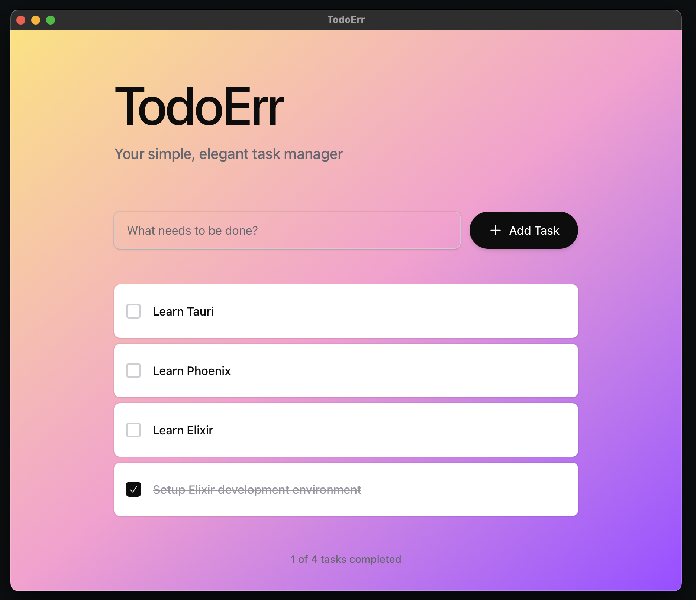

# TodoErr

A beautiful, modern task management application built with Phoenix LiveView and packaged as a desktop app using Tauri.

> **Note:** Currently supports **macOS only** (Apple Silicon & Intel). Windows and Linux support coming soon.



## Features

- ✅ Add, complete, and delete tasks
- ✅ Real-time updates with Phoenix LiveView
- ✅ Modern glassmorphic UI with cyan/teal color scheme
- ✅ SQLite database for local storage
- ✅ Native desktop app for macOS (via Tauri v2)
- ✅ Offline-first architecture

## Development

### Prerequisites

- Elixir 1.14+ and Erlang/OTP 25+
- Node.js 18+ (for asset compilation)
- Rust 1.70+ (for Tauri desktop app)

### Running the Phoenix Server

```bash
# Install dependencies
mix setup

# Start the Phoenix server
mix phx.server
```

Visit [`localhost:4000`](http://localhost:4000) in your browser.

### Building the Desktop App

```bash
# Full clean build (recommended for first build or after major changes)
./scripts/build_and_run.sh

# Fast incremental build (much faster, good for iterating)
./scripts/build_and_run.sh --fast

# Build without opening the app
./scripts/build_and_run.sh --no-open

# Fast build without opening
./scripts/build_and_run.sh --fast --no-open
```

**Build Modes:**
- **Full clean build** (default): Cleans all caches, ~2-3 minutes
- **Fast build** (`--fast`): Incremental build, ~30-60 seconds

The desktop app will be available at:
- `src-tauri/target/release/bundle/macos/TodoErr.app`
- `src-tauri/target/release/bundle/dmg/TodoErr_0.1.0_aarch64.dmg`

## Tech Stack

- **Backend**: Phoenix 1.8, Elixir
- **Frontend**: Phoenix LiveView, Tailwind CSS v4
- **Database**: SQLite (via Ecto)
- **Desktop**: Tauri v2
- **Asset Pipeline**: esbuild

## Project Structure

```
todo_err/
├── lib/
│   ├── todo_err/           # Business logic
│   └── todo_err_web/       # Web interface (LiveView)
├── assets/                 # Frontend assets (JS, CSS)
├── priv/                   # Static files and migrations
├── src-tauri/             # Tauri desktop app
└── scripts/               # Build and deployment scripts
```

## Platform Support

| Platform | Status | Architecture |
|----------|--------|--------------|
| macOS    | ✅ Supported | Apple Silicon (M1/M2/M3) & Intel |
| Windows  | 🚧 Coming Soon | - |
| Linux    | 🚧 Coming Soon | - |

## Documentation

- [Cache Busting Strategy](CACHE_BUSTING.md) - How we handle caching and ensure fresh builds
- [AI Agent Guidelines](AGENTS.md) - Development guidelines for AI assistants

## Troubleshooting

### Build Issues

If you encounter build issues:

1. **Try a full clean build:**
   ```bash
   ./scripts/build_and_run.sh
   ```

2. **If Erlang node conflicts occur:**
   ```bash
   killall -9 beam.smp epmd
   epmd -kill
   ```

3. **Clear all caches manually:**
   ```bash
   rm -rf _build/prod
   rm -rf priv/static/assets
   rm -rf src-tauri/target
   cd src-tauri && cargo clean && cd ..
   ```

### App Won't Start

Check the logs:
```bash
tail -f ~/Library/Logs/com.todoerr.desktop/TodoErr.log
```

## Learn More

- **Phoenix Framework:** https://www.phoenixframework.org/
- **Tauri:** https://tauri.app/
- **Tailwind CSS:** https://tailwindcss.com/
- **Phoenix LiveView:** https://hexdocs.pm/phoenix_live_view/

## License

This project is open source and available under the MIT License.
